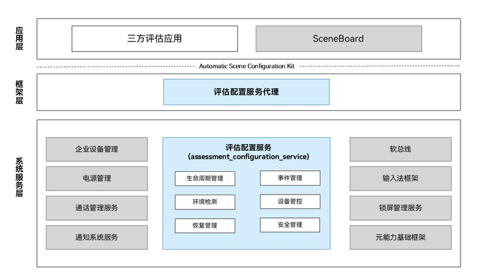

# 评估配置服务（Assessment Configuration Service）

## 简介

评估配置服务（Assessment Configuration Service，下文简称本服务）面向教育、测评、考试等场景的三方评估应用（下文简称调用方），提供进入评估模式的能力。应用申请进入评估模式后，本服务完成启动前的环境安全检测并进入Kiosk模式（仅允许清单范围内的应用运行），在评估时长到期、调用方退出或主动结束时自动解除管控并通知调用方。评估期间的管控由本服务与协同部件共同实施；评估状态通过系统参数持久化，本服务异常重启后按退出评估模式处理。

表1 部件信息
| 项 | 值 |
|------|------|
| 部件名 | `assessment_configuration_service`（子系统 `customization`） |
| SysCap | `SystemCapability.Customization.AssessmentConfiguration` |
| SystemAbility | SystemAbility ID（SAID）`8660`，库 `libassessmentsvcs.z.so`，按需拉起（`ondemand`）、支持自动重启 |
| 运行进程 | `assessment_service`（由 `sa_main` 托管，uid/gid: `system`，APL: `system_basic`） |
| 开发语言 | C++（服务、Inner Kit、NAPI）、ArkTS（应用侧调用） |

## 系统架构

**图1** 评估配置服务架构图



评估配置服务架构图说明：

- 调用方的请求经Automatic Scene Configuration Kit进入框架层后，首先到达**评估配置服务代理**，再由代理通过SAManager按需拉起并访问系统服务层的评估配置服务，实现应用层到系统服务层的进程间通信（IPC）。
- 系统服务层的评估配置服务（assessment\_configuration\_service）包含生命周期管理、事件管理、环境检测、设备管控、恢复管理、安全管理六个模块。
- 评估模式所需的Kiosk管控、设备管控、通知与互联管控等能力，由协同系统服务提供接口支撑。


### 模块功能说明

整体架构自上而下划分为应用层、Automatic Scene Configuration Kit、框架层与系统服务层（系统服务层含评估配置服务与协同系统服务）。

* **应用层**
  * **三方评估应用**：通过Automatic Scene Configuration Kit申请进入和退出评估模式、查询评估状态，并接收评估状态回调；三方评估应用需持有`ohos.permission.ASSESSMENT_CONFIGURATION`（系统授权）。
  * **SceneBoard**：由元能力基础框架经 IPC 通知进入/退出 Kiosk 并下发允许应用列表，据此隐藏通知中心、控制中心、实况胶囊、多任务中心、开始菜单、三键导航等界面元素，本服务不直接调用其接口。

* **Automatic Scene Configuration Kit**：面向应用的评估模式配置接口（begin、end、isActive、getConfiguration及评估状态回调）。

* **框架层**
  * **评估配置服务代理**：负责接收Kit的调用请求，完成参数校验、调用方包名补入与回调桥接，以及按需拉起服务、IPC转发与回调分发。

* **系统服务层（assessment_service）**
  * **评估配置服务**
    * **生命周期管理**：管理事件管理、环境检测、设备管控、恢复管理和安全管理模块的初始化流程、评估时长倒计时、评估状态持久化（系统参数），并监听调用方的进程状态。
    * **事件管理**：公共事件管理，订阅休眠、关机、省电模式变化等系统事件与输入子系统的LID（合盖开关）事件，在系统状态变化时退出评估模式。
    * **环境检测**：评估开始前与评估期间的环境安全检测，识别并阻止不满足进入评估模式的场景，主要包括：
      * 录屏与截屏：检测是否正在录屏、截屏；
      * 多屏与投屏：检测外接显示与投屏状态，防止评估内容外泄；
      * 通话状态：检测是否正在通话，通话中不进入评估模式；
      * MDM设备：检测是否为企业移动设备管理（MDM）受管设备，避免与评估模式冲突；
      * 检测不通过时不进入评估模式。
    * **设备管控**：实现设备管控能力，例如来电拒接等；具体能力见[核心能力](#核心能力)，具体实现见[关键交互流程](#关键交互流程)。
    * **恢复管理**：异常场景（如服务进程重新拉起、应用crash等）下恢复系统功能、解除评估限制。
    * **安全管理**：日志管理、调用方权限校验（`ohos.permission.ASSESSMENT_CONFIGURATION`）等安全控制。
  * **协同系统服务**
    * **元能力基础框架**：提供Kiosk模式进出接口，供评估配置服务调用，实现单应用模式、禁止应用拉起、未允许运行的应用退出等管控；进出Kiosk模式时发布Kiosk模式公共事件，事件参数中标识本次进入是否源自评估模式，供协同部件监听。
    * **企业设备管理**：提供移动设备管理（MDM）设备查询接口，供评估配置服务调用，用于识别受管设备，避免与评估模式冲突。
    * **电源管理**：提供锁屏管控接口，供评估配置服务调用，实现评估期间禁止自动锁屏与用户锁屏。
    * **通话管理服务**：提供通话状态查询与来电拒接接口；评估配置服务订阅来电事件后调用其拒接接口，由通话管理服务执行拒接并生成未接来电记录。
    * **通知系统服务**：监听Kiosk模式公共事件，实现评估期间通知受限。
    * **软总线**：提供软总线查询与开关接口，供评估配置服务调用，既作为评估开始前的检查项，也在评估期间禁用跨设备互联。
    * **输入法框架**：监听Kiosk模式公共事件，实现评估期间禁止切换输入法。
    * **锁屏管理服务**：监听Kiosk模式公共事件，实现评估期间锁屏界面仅支持受限功能。

### 核心能力

**Kiosk管控**
- 校验通过后进入Kiosk模式；结束、超时或异常路径统一解除管控。

**评估期间的设备功能限制**

进入评估模式后，设备功能被大幅限制。本服务负责接收调用方下发的允许运行的应用列表、触发进出Kiosk模式、在到期或异常时解除管控，并实施部分限制；其余限制由Kiosk模式实施，可由本服务调用协同系统服务接口，或由协同部件监听Kiosk模式公共事件（含评估模式标识）后实施。
- 评估期间只允许三方评估应用运行，不能退出该应用或切换到其它应用；
- 三方评估应用可以通过设置allowedApps参数，允许其它应用在评估期间运行（例如计算器），不在allowedApps参数中的应用，在进入评估模式后，系统强制杀掉；
- 禁止远程控制能力；
- 禁止通过系统能力截屏和录屏，调用方可自行截屏录屏；
- 禁用画中画、悬浮窗、闪控球（窗口管理同步Kiosk状态与允许运行的应用列表后实施）；
- 禁用AI助手，包括语音唤醒与快捷键唤醒；
- 禁用划词查词。
- 隐藏通知中心、控制中心、实况胶囊、多任务中心、开始菜单、三键导航（SceneBoard）；
- 评估期间通知提醒受限，包括无铃声、震动、横幅、实况卡片（包含NFC）等，包含Push通和系统服务通知；
- 限制转发通知到三方设备（通知系统服务）；
- 禁用分布式软总线，评估期间屏蔽跨设备消息转发（软总线）；
- 来电自动拒接：本服务订阅来电事件后执行拒接，并生成未接来电记录；
- 禁止切换输入法（输入法框架）；
- 禁止自动锁屏与用户锁屏（电源管理）；
- 限制锁屏界面功能（锁屏管理服务）；

**评估时长与自动解除**
- 评估时长单位为毫秒，0取默认8小时，上限8小时。
- 服务以5秒为最大时间片轮询，剩余不足5秒时按剩余时长收敛；到期判定基于进入评估时记录的绝对到期时间点，轮询抖动不会累积，实际解除时刻相对设定时长仅有毫秒级偏差（线程唤醒与调度延迟）。到期后自动解除管控。
- 监听调用方进程，调用方退出即结束评估。

**系统事件联动**
- 订阅休眠、关机、省电模式变化等系统事件与输入子系统的LID（合盖开关）事件，适配2in1形态：休眠、关机、省电模式变化、合盖时退出评估模式（解除Kiosk与各项限制、清理评估上下文与参数并回调）。

**状态持久化**
- 评估状态写入系统参数持久化。

**异常重启策略**
- 服务进程异常退出后重新拉起时，直接退出评估模式：解除Kiosk与各项管控、恢复系统功能。

**回调通知**
- 向调用方回调 onBegin、onInterrupted、onEnd。

### 关键交互流程

以下详解三条核心流程。

#### 进入评估模式

1. **调用方发起申请**：调用方调用`begin(context, config, callback)`；NAPI完成参数校验与调用方包名补入，并把JS回调桥接为C++回调对象，经`AssessmentServiceClient`按需加载本服务后发起IPC调用。
2. **本服务准入校验**：安全管理模块经`AssessmentServiceUtils`校验设备形态与调用方权限（`ohos.permission.ASSESSMENT_CONFIGURATION`）；环境检测模块经`EnvChecker::CheckAll()`检测录屏与截屏（`Rosen::DisplayManager::IsCaptured`）、多屏与投屏（`Rosen::ScreenManager`、`DistributedHardware::DeviceManager::GetAvailableDeviceList`）、通话状态（`Telephony::CallManagerClient`）、MDM设备等；生命周期管理模块生成评估上下文（token、回调、到期时间点）并写入评估状态参数；任一校验不通过则不进入评估模式，由本服务回调`onBegin`返回失败结果（环境检测不通过为`ENV_ANOMALY`，code=4）。
3. **本服务注册进程监听**：生命周期管理模块通过`RegisterApplicationStateObserver`注册调用方进程状态观察者，调用方进程退出时触发退出评估。
4. **本服务订阅事件**：事件管理模块经`CommonEventManager::SubscribeCommonEvent`订阅休眠（`usual.event.ENTER_HIBERNATE`）、关机（`usual.event.SHUTDOWN`）、省电模式变化（`usual.event.POWER_SAVE_MODE_CHANGED`）等系统事件，经`MMI::InputManager::SubscribeSwitchEvent`订阅LID（合盖开关）事件（`SwitchEvent::SWITCH_LID`），并经`Telephony::TelephonyObserverClient::AddStateObserver`注册来电状态观察。
5. **本服务下发允许应用列表**：设备管控模块调用元能力基础框架的`AbilityManagerClient::AddKioskApplicationList`下发允许运行的应用列表，元能力基础框架经 IPC 同步给 SceneBoard。
6. **本服务进入Kiosk模式并实施各项限制**：设备管控模块调用元能力基础框架的`AbilityManagerClient::EnterKioskMode`进入[Kiosk模式](https://gitcode.com/openharmony/docs/blob/master/zh-cn/application-dev/reference/apis-ability-kit/js-apis-app-ability-kioskManager.md)（未允许运行的应用退出、禁止用户切换出该应用、禁止远程控制能力、禁止系统能力截屏录屏、禁止画中画、悬浮球、闪控球、禁止AI助手、划词查词和隐藏通知中心、控制中心、实况胶囊、多任务中心、开始菜单、三键导航）；元能力基础框架经 IPC 通知 SceneBoard 进入 Kiosk 并下发允许应用列表，同时发布Kiosk模式公共事件`usual.event.KIOSK_MODE_ON`（事件参数标识本次进入源自评估模式），通知系统服务、输入法框架、锁屏管理服务监听后各自实施对应限制：
    - SceneBoard：由元能力基础框架经 IPC 调用 `SceneSessionManagerLite::UpdateKioskAppList`/`EnterKioskMode` 下发允许应用列表与 Kiosk 状态，隐藏通知中心、控制中心、实况胶囊、多任务中心、开始菜单、三键导航等界面元素；
    - 通知系统服务：通知受限，包括无铃声、震动、横幅等；
    - 输入法框架：禁止切换输入法；
    - 锁屏管理服务：不显示锁屏通知、服务卡片；禁用锁屏界面下拉控制中心；禁止切换隐私空间/多用户；禁止双指捏合/长按时钟进入锁屏编辑；

    本服务自身限制：
    - 来电自动拒接由设备管控模块（`ProcessController`）经`AssessmentTelephonyObserver::OnCallStateUpdated`感知来电后调用通话管理服务的`CallManagerProxy::RejectCall`；
    - 禁止自动灭屏后锁屏调用电源管理`PowerMgrClient::LockScreenAfterTimingOut(false, false)`；
    - 禁用分布式软总线调用`ServiceControl("softbus_server", ServiceAction::STOP)`。
7. **本服务持久化状态**：生命周期管理模块经`SaveState`将评估状态写入`persist.assessment.is_active`、`persist.assessment.duration`、`persist.assessment.allowed_apps`，并将评估状态置为已激活。
8. **本服务回调并启动倒计时**：由本服务回调`onBegin`（code=0）告知调用方进入成功；生命周期管理模块启动倒计时线程，以5秒为最大时间片检查到期。

#### 退出评估模式

1. **调用方发起结束**：调用方调用`end(context)`，须使用与`begin`相同的context（token）；NAPI经`AssessmentServiceClient`发起IPC调用，生命周期管理模块校验评估激活状态与token（未激活返回36700003，token不匹配返回36700004）。
2. **本服务解除Kiosk模式**：设备管控模块调用元能力基础框架的`AbilityManagerClient::ExitKioskMode`解除Kiosk管控；元能力基础框架经 IPC 通知 SceneBoard 退出 Kiosk，同时发布Kiosk模式公共事件`usual.event.KIOSK_MODE_OFF`（事件参数标识本次退出源自评估模式），通知系统服务、输入法框架、锁屏管理服务监听后恢复对应能力。
3. **本服务恢复各项限制**：调用`AbilityManagerClient::ExitKioskMode`后，Kiosk模式实施的各项限制随退出恢复；设备管控模块（`ProcessController::Deactivate`）停止来电拒接；调用电源管理`PowerMgrClient::LockScreenAfterTimingOut(true, false)`恢复自动灭屏后锁屏；调用`ServiceControl("softbus_server", ServiceAction::START)`恢复分布式软总线；协同部件监听Kiosk模式公共事件后自行恢复通知、输入法、锁屏界面等限制。
4. **本服务注销监听**：生命周期管理模块注销调用方进程状态观察者、停止倒计时线程；事件管理模块经`CommonEventManager::UnSubscribeCommonEvent`取消系统事件订阅、取消LID（合盖开关）事件订阅，并经`Telephony::TelephonyObserverClient::RemoveStateObserver`移除来电状态观察。
5. **本服务清理状态**：生命周期管理模块经`ClearState`清理`persist.assessment.*`参数与评估上下文，避免限制残留。
6. **本服务回调结果**：由本服务回调`onEnd`告知调用方评估结束。

#### 中断评估

中断由本服务发起，处理与退出评估模式一致（解除Kiosk管控、恢复各项限制、清理状态），差异在于触发方与回调：

1. **评估时长到期**：生命周期管理模块的倒计时线程以5秒为最大时间片比较当前时间与进入评估时记录的绝对到期时间点（`duration`为0时取默认8小时），剩余不足5秒时按剩余时长收敛；到期后解除管控，由本服务回调`onInterrupted`（`TIMEOUT`，code=2）告知调用方评估被中断。
2. **环境异常**：评估期间环境检测模块检出环境异常，设备管控模块解除管控，由本服务回调`onInterrupted`（`ENV_ANOMALY`，code=4）告知调用方。
3. **系统事件触发**：事件管理模块收到休眠（`usual.event.ENTER_HIBERNATE`）、关机（`usual.event.SHUTDOWN`）、省电模式变化（`usual.event.POWER_SAVE_MODE_CHANGED`）或合盖（`SwitchEvent::SWITCH_LID`）事件时退出评估模式。
4. **调用方退出**：生命周期管理模块的应用状态观察者感知调用方进程消失后，解除管控并清理评估上下文与`persist.assessment.*`参数。
5. **服务重启**：恢复管理模块在服务进程异常退出后重新拉起时直接退出评估模式，不恢复评估上下文、不续跑倒计时，调用方需重新发起`begin`。

### 相关概念与术语

表2 相关概念与术语
| 概念 / 术语 | 含义 |
|-------------|------|
| 评估上下文 | 服务侧持有的一次评估的运行时数据：调用方token、回调、`duration`、`allowedApps`与到期时间点 |
| 允许运行的应用 | 调用方在`begin`时下发的应用包名列表，Kiosk期间允许运行，通常为三方评估应用及其配套应用 |
| 评估时长 | `duration`（毫秒），`0`表示默认8小时，上限8小时 |
| 评估配置 | 当前评估的 `duration` 与 `allowedApps`，可由 `getConfiguration` 查询 |
| 评估模式 | 设备进入的受控评估环境状态，由调用方经 `begin` 申请进入，`end` 或异常时退出 |
| 调用方 | 经 Automatic Scene Configuration Kit 申请进入/退出评估模式的三方评估应用（下文简称） |
| Kiosk模式 | 元能力基础框架提供的单应用锁定模式，仅允许指定应用运行；评估模式在其上叠加管控 |
| 协同系统服务 | 与评估配置服务共同实施评估期间限制的系统部件，如元能力基础框架、通知系统服务、电源管理、通话管理服务等 |

## 目录

评估配置服务源代码目录结构如下所示：

```text
/base/customization/assessment_configuration_service
├── figure
│   └── assessment_configuration_service.png     # 架构图
├── frameworks
│   └── js/napi
│       ├── BUILD.gn                             # NAPI 库编译（libassessment_napi.z.so）
│       └── assessment
│           ├── assessment_napi.cpp/.h           # JS 接口实现与参数校验
│           └── js_assessment_callback.cpp/.h    # JS 回调桥接
├── interfaces
│   └── inner_api/assessment_service
│       ├── BUILD.gn                             # Inner Kit 库编译（libassessment_manager.z.so）
│       ├── IAssessmentService.idl               # 评估配置服务 IPC 接口定义
│       ├── IAssessmentCallback.idl              # 回调 IPC 接口定义
│       ├── include                              # 评估配置服务客户端、错误码、日志标签头文件
│       └── src                                  # 评估配置服务客户端实现、错误码与 SA 加载回调
├── patches
│   └── patches.json                             # 依赖的其它仓配套 PR
├── services
│   └── assessment_service
│       ├── BUILD.gn                             # 服务库编译（libassessmentsvcs.z.so）
│       ├── etc
│       │   ├── assessment_service.cfg           # init 服务配置（sa_main 托管、按需拉起、服务侧权限）
│       │   └── param
│       │       ├── assessment.para              # 系统参数默认值
│       │       └── assessment.para.dac          # 系统参数 DAC
│       ├── include                              # 模块头文件（生命周期管理、事件管理、环境检测、设备管控、恢复管理、安全管理）
│       ├── sa_profile
│       │   └── assessment_service.json          # Assessment Service SystemAbility 配置（SAID 8660）
│       └── src                                  # 模块实现代码（生命周期管理、事件管理、环境检测、设备管控、恢复管理、安全管理）
├── test
│   └── unittest                                 # 单元测试（含 mock）
├── assessment.gni                               # 部件路径与编译开关定义
├── BUILD.gn                                     # 部件编译入口
├── bundle.json                                  # 部件描述文件
├── LICENSE                                      # 开源协议（Apache 2.0）
├── README.md                                    # 中文说明文档
└── README_en.md                                 # 英文说明文档
```

## 编译构建

本部件为OpenHarmony源码树内的native部件，使用GN + ninja构建。

### 环境要求

- 已同步的OpenHarmony全量源码树（standard系统，如 `rk3568` 产品）
- 部件已挂入产品配置（`customization` 子系统）

### 编译命令

在源码根目录执行，`--product-name` 替换为实际产品名：

```bash
# 编译整个部件
./build.sh --product-name <产品名> --ccache --build-target assessment_configuration_service

# 仅编译服务本体
./build.sh --product-name <产品名> --ccache --build-target base/customization/assessment_configuration_service/services/assessment_service:assessmentsvcs

# 编译单元测试
./build.sh --product-name <产品名> --ccache --build-target base/customization/assessment_configuration_service/test/unittest:unittest
```

### 构建产物

表3 构建产物
| 产物 | 类型 | 说明 |
|------|------|------|
| `libassessmentsvcs.z.so` | SA库 | 评估配置服务本体 |
| `libassessment_manager.z.so` | Inner Kit | 系统侧客户端库 |
| `libassessment_napi.z.so` | NAPI | 应用侧JS接口库，安装到 `module/customization` |
| `assessment_service.json` | SA profile | 部署到 `/system/profile` |
| `assessment_service.cfg` | init配置 | 部署到 `/system/etc/init` |
| `assessment.para`、`assessment.para.dac` | 系统参数 | 参数默认值与DAC配置 |

## 评估配置服务开发

本服务采用**C++**开发，基于SystemAbility框架与IDL IPC；应用侧经NAPI导出JS接口。各目录职责见「目录」章节。


### 基于已有模块的开发

适用场景：对已有能力做功能定制，例如调整评估上下文管理逻辑、扩展允许应用校验、修改倒计时与解除逻辑、补充事件订阅等。

明确改动点：按业务边界定位改动目录：

- 应用侧接口行为：`frameworks/js/napi`；
- 接口签名：同步IDL、客户端与NAPI；
- 业务链路：`services/assessment_service`；
- 服务权限、参数默认值与拉起方式：`etc`与`sa_profile`。

逐项对照见表4。

表4 改动位置对照
| 修改内容 | 修改位置 | 说明 |
|------------|----------|------|
| JS接口行为、参数校验 | `frameworks/js/napi/assessment/assessment_napi.cpp` | 导出函数在 `descriptors[]` 中用 `DECLARE_NAPI_FUNCTION` 注册 |
| JS回调桥接 | `frameworks/js/napi/assessment/js_assessment_callback.cpp` | C++ 回调转JS回调 |
| IPC接口签名 | `interfaces/inner_api/assessment_service/IAssessmentService.idl`、`IAssessmentCallback.idl` | Proxy/Stub由 `idl_gen_interface` 在构建期生成，**不要手写** |
| 系统侧C++ 客户端 | `interfaces/inner_api/assessment_service/include/assessment_service_client.h`、`src/assessment_service_client.cpp` | 按需加载SA并转发调用 |
| 错误码 / 回调码 | `interfaces/inner_api/assessment_service/include/assessment_api_error_code.h`、`assessment_callback_code.h`、`src/assessment_api_error_code.cpp` | 枚举与描述需成对维护 |
| 评估上下文管理与业务逻辑 | `services/assessment_service/src/assessment_service.cpp`（头文件在 `include/`） | 注意 `mutexSa_` 的锁范围，沿用 `LockedUnsafe` 命名约定 |
| 环境检测 | `services/assessment_service/src/env_checker.cpp`（头文件在 `include/`） | 检测项实现 |
| 设备管控 | `services/assessment_service/src/process_controller.cpp`（头文件在 `include/`） | 来电拒接、软总线禁用等管控实施 |
| 公共事件订阅与处理 | 订阅列表与`DispatchEvent`处理分支在`services/assessment_service/src/assessment_service.cpp`；订阅/退订动作在`services/assessment_service/src/assessment_event_manager.cpp` | 订阅列表与事件处理分支需成对修改 |
| 回调分发 | `services/assessment_service/src/callback_manager.cpp` | 按调用方token分发 |
| 应用进程状态监听 | `services/assessment_service/src/assessment_service_app_state_cb.cpp` | 调用方退出时的处理 |
| 权限校验、设备类型等工具函数 | `services/assessment_service/src/assessment_utils.cpp` | — |
| init配置、系统参数、SA profile | `services/assessment_service/etc/`、`services/assessment_service/sa_profile/` | 改服务权限、参数默认值、拉起方式 |
| 单元测试 | `test/unittest/src/` | 新建测试文件需登记到同目录 `BUILD.gn` 的 `sources`；mock见 `test/unittest/mock/` |

以下列举常见修改场景：

**场景1：新增某项评估期间的限制**

- 由本服务实施的限制：在`services/assessment_service/src/assessment_service.cpp`的进入流程中新增管控调用，并在退出流程中成对恢复；依赖系统事件的还需在`SubscribeCommonEvent()`与`assessment_event_manager.cpp`成对新增订阅与处理分支
- 由Kiosk模式实施的限制：Kiosk模式相关能力不允许在本仓修改（见「约束」），仅可调整调用方下发的允许运行的应用范围，其余需由元能力基础框架侧配合新增
- 由协同系统服务实施的限制：协同部件监听Kiosk模式公共事件（含评估模式标识）后自行生效，本仓不直接实现，新增时需由对应部件侧配合
- 若限制项需按应用或按场景可配置：扩展`config`字段并同步IDL、客户端与NAPI，避免在服务侧硬编码

例如，需新增评估期间禁用某项系统能力：该项由本服务实施，在`services/assessment_service`的进入流程中新增管控调用、并在退出流程中成对恢复即可；若要求仅对部分应用或场景生效，则在`config`中新增开关字段并沿IPC链路透传到服务侧，由服务在生效限制时按字段判断。

**场景2：放开某项评估期间的限制**

- 由本服务实施的限制（软总线禁用、来电自动拒接）：改动集中在`services/assessment_service/src/assessment_service.cpp`的进入与退出流程，以及事件订阅与处理分支
- 由Kiosk模式实施的限制（单应用模式、未允许运行的应用退出与禁止拉起、禁止系统截屏录屏、画中画与悬浮窗、AI助手、划词查词）：Kiosk模式相关能力不允许在本仓修改（见「约束」），仅可调整调用方下发的允许运行的应用范围，其余需由元能力基础框架侧配合修改
- 由协同系统服务实施的限制（通知受限、禁止切换输入法、锁屏界面受限、隐藏通知中心等界面元素）：协同部件监听Kiosk模式公共事件（含评估模式标识）后自行生效，本仓不直接实现，放开时需由对应部件侧配合修改
- 若限制项需按应用或按场景可配置：扩展`config`字段并同步IDL、客户端与NAPI，避免在服务侧硬编码

例如，需放开评估期间的来电自动拒接：该项由本服务直接实施，在`services/assessment_service`中对应的管控调用处放开即可；若要求仅对允许运行的应用应用放开，则在`config`中新增开关字段并沿IPC链路透传到服务侧，由服务在生效限制时按字段判断。

### 新特性能力的开发

下面用**新增一个应用侧查询接口**（示意：查询剩余评估时长）串起完整步骤与前后依赖关系。

#### 目标业务（示例）

希望调用方能查询当前评估的剩余时长，用于界面倒计时展示。因此需要同时具备：**服务侧计算能力**、**IPC接口**、**JS接口**。三步对应这三条能力链路，顺序一般是**先服务 → 再IPC → 后JS**。

**步骤1：扩展服务能力（在服务层写清"剩余时长如何计算"）**

表5 剩余时长接口要解决的问题

| 要解决的问题 | 说明 |
|--------------|------|
| 评估未激活时如何返回 | 按`ERR_ASSESSMENT_NOT_ACTIVE`返回，避免调用方拿到无意义数值 |
| 剩余时长从哪来 | 用`endpointCheckPoint_`减当前时间，需在`mutexSa_`锁内读取，避免与倒计时线程竞争 |

**步骤2：扩展IPC接口（打通服务实现与应用侧调用的链路）**

- 在`interfaces/inner_api/assessment_service/IAssessmentService.idl`声明`GetRemainingDuration`，Proxy/Stub由`idl_gen_interface`在构建期生成；
- 在`assessment_service_client.h`与`assessment_service_client.cpp`增加同名转发方法，沿用`GetConfiguration`的加载与调用模式。

**步骤3：导出JS接口（应用看见并调用步骤1的能力）**

- 在`assessment_napi.cpp`实现`AssessmentNapiGetRemainingDuration`，并在`descriptors[]`中注册；
- 在`test/unittest/src/assessment_service_test.cpp`补充用例，新测试文件需登记`BUILD.gn`。

**三步关系小结**：步骤1决定数值是否正确；步骤2决定跨进程能否调用；步骤3决定应用能否使用。缺任一步会出现"有逻辑调不到""有接口无实现"等问题。

### 验证

```bash
# 编译服务本体
./build.sh --product-name <产品名> --ccache --build-target base/customization/assessment_configuration_service/services/assessment_service:assessmentsvcs

# 编译单元测试
./build.sh --product-name <产品名> --ccache --build-target base/customization/assessment_configuration_service/test/unittest:unittest
```

## 约束

**语言限制**：C++、ArkTS

**设备类型**：仅支持2in1、phone、tablet（依据`const.product.devicetype`判断，其它设备类型返回801）

**并发限制**：同一时刻仅支持一个评估，重复begin返回36700002；end必须使用与begin相同的token

**允许运行的应用数量限制**：经系统参数持久化的应用列表最多20个，总长度不超过2048字符。

**修改边界**

- 不允许修改：Kiosk模式相关能力（未允许运行的应用退出、禁止用户切换出该应用、禁止远程控制能力、禁止系统能力截屏录屏、禁止画中画、悬浮球、闪控球、禁止AI助手、划词查词和隐藏通知中心、控制中心、实况胶囊、多任务中心、开始菜单、三键导航等）由元能力基础框架提供；协同部件实施的限制（通知受限、禁止切换输入法、锁屏界面受限、隐藏通知中心等界面元素）由对应部件实现；两者均不在本仓修改，Kiosk模式仅可调整调用方下发的允许运行的应用范围。
- 可以修改：本服务自身提供的能力，包括允许运行的应用列表的接收与持久化逻辑、评估时长取值、进入/退出/中断流程、本服务实施的设备管控（来电自动拒接、禁用分布式软总线、限制锁屏等）、公共事件订阅与处理分支、错误码与回调码、init配置/系统参数/SA profile，以及单元测试。

## 常见问题

**begin返回36700002是什么原因？**

同一时刻仅支持一个评估，需先调用end结束当前评估后再次begin。

**服务重启后评估状态是否保留？**

系统参数`persist.assessment.*`中的取值保留，但评估不恢复：服务重新拉起时直接退出评估模式、不续跑倒计时，应用需重新发起`begin`。

## 开发指南

[评估配置服务应用开发指南](https://gitcode.com/weredust/docs_1670/blob/master/zh-cn/application-dev/assessment/assessment-guide.md)

[评估配置服务应用开发API](https://gitcode.com/weredust/docs_1670/blob/master/zh-cn/application-dev/reference/apis-assessment-kit/js-apis-customization-assessment.md)

## 参与贡献

代码、文档等贡献的流程与方式参见[参与贡献](https://gitcode.com/openharmony/docs/blob/master/zh-cn/contribute/%E5%8F%82%E4%B8%8E%E8%B4%A1%E7%8C%AE.md)。

## 开源协议

本部件遵循 [Apache 2.0](LICENSE) 开源协议。

## Changelog

表6 Changelog

| 时间 | 主要变更 |
|------|----------|
| 2026-08 | 首次开源：提供评估模式配置接口（`begin`、`end`、`isActive`、`getConfiguration`）与评估状态回调（`onBegin`、`onInterrupted`、`onEnd`），支持Kiosk管控、评估时长与自动解除、评估状态持久化 |
| 2026-09 | 对接AMS进出Kiosk模式接口；新增三方评估应用进程状态监听；回调码枚举`SECURITY_BREACH`更名为`ENV_ANOMALY`；移除anco与低功耗管理相关引用；补充服务与工具类单元测试 |

## 相关仓

- [**openharmony-sig/customization\_assessment\_configuration\_service**](https://gitcode.com/openharmony-sig/customization_assessment_configuration_service)（本仓）
- [openharmony/ability\_runtime](https://gitcode.com/openharmony/ability_ability_runtime)（Kiosk模式、应用状态监听）
- [openharmony/ability\_base](https://gitcode.com/openharmony/ability_ability_base)（Want等基础定义）
- [openharmony/telephony\_call\_manager](https://gitcode.com/openharmony/telephony_call_manager)（通话状态与来电管控）
- [openharmony/security\_selinux\_adapter](https://gitcode.com/openharmony/security_selinux_adapter)（SELinux策略）
- [openharmony/docs](https://gitcode.com/openharmony/docs)（开发指南与接口文档）
